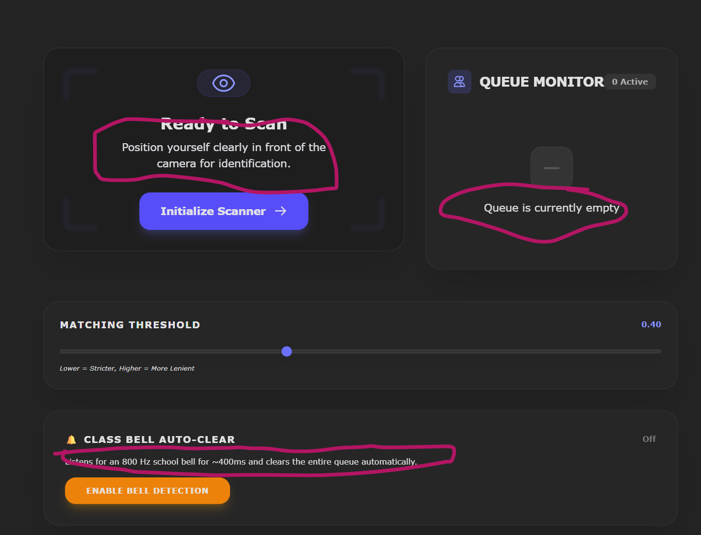
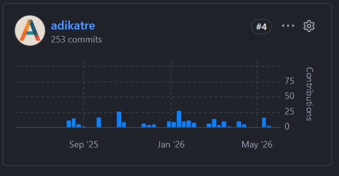

Documentation and personal/social relevance demonstrated across `bathroom/`, `S3uploads/`, and `groups/chat/`.

**Source:** [Pirna-spring](https://github.com/adikatre/Pirna-spring) (Spring backend) · [Pirna-pages](https://github.com/adikatre/Pirna-pages) (frontend)

## Course alignment

| Learning Objective | Evidence Required | Assessment Method |
| --- | --- | --- |
| Code Comments | JavaDoc comments for classes, methods, complex logic | Code review: Comment density >10%, JavaDoc completeness |
| API Documentation | Document API endpoints, parameters, request/response formats | Documentation: Postman collections, API reference in blog |
| Help System | Create user guide or in-app help for features | Blog review: Help documentation with screenshots/videos |
| Blog Portfolio | Maintain detailed blog showing design, code, contributions | Blog review: Design docs, code highlights, PR/commit links |
| Project Impact | Demonstrate how project addresses real-world problem | Blog/Demo: Clear explanation of project purpose and impact |
| Ethical Considerations | Address privacy, security, accessibility, equity in design | Documentation: Security practices, ethical design decisions |

---

## Documentation

### Code Comments

*Evidence required — JavaDoc comments for classes, methods, complex logic.*  
*Assessment — Code review: Comment density >10%, JavaDoc completeness.*

**Class-level JavaDoc with Swagger context.** `BathroomQueueApiController.java:36-46` documents the controller purpose, endpoint scope, classroom management functionality, and the API grouping for Swagger/OpenAPI.

```java id="3fxjlwm"
/**
 * This class provides RESTful API endpoints for managing BathroomQueue
 * entities.
 * It includes endpoints for creating, retrieving, updating, and managing
 * bathroom queue operations for classroom management.
 */
@RestController
@RequestMapping("/api/bathroom")
@CrossOrigin(origins = {
    "http://localhost:8585",
    "https://pages.opencodingsociety.com/"
})
@Tag(
    name = "Bathroom Queue API",
    description = "Endpoints for managing the bathroom queue"
)
public class BathroomQueueApiController { ... }
```

**Method-level JavaDoc with `@param`.** `BathroomQueue.java:36-46` and `BathroomQueue.java:48-59` document constructor and mutator parameters, improving API readability, IDE autocomplete help, contributor onboarding, and generated documentation quality.

```java id="2yq0k2"
/**
 * Constructor which creates each element in the queue
 *
 * @param teacherEmail - the teacher's email for what class they are from
 * @param peopleQueue  - the people in the queue
 */
public BathroomQueue(String teacherEmail, String peopleQueue) { ... }
```

```java id="8p3i9d"
/**
 * Function to add a student to the queue
 *
 * @param studentName - the name you want to add to the queue
 */
public void addStudent(String studentName) { ... }
```

**Complex logic comments.** `BathroomQueue.java:102-107` explains a non-obvious invariant — only students currently marked as "away" can decrement occupancy counts. Without this comment, the queue logic is harder to reason about.

```java id="ybx0xn"
// ONLY decrease away if the student was actually
// in the "away" portion
if (studentIndex < this.away) {

    if (this.away > 0) {
        this.away--;
    }
}
```

**Service-level JavaDoc.** `GroupChatPresenceService.java:14-19` documents WebSocket session tracking, the real-time presence architecture, and group membership state management.

```java id="0ffn5q"
/**
 * Service managing user presence within specific chat groups.
 * Enables tracking the real-time participation of group members connected
 * via WebSocket by retaining active session identifiers mapped to the
 * corresponding usernames and actively joined groups.
 */
@Service
public class GroupChatPresenceService { ... }
```

**Annotation explainer comments.** `Groups.java:48-60` helps newer developers understand Spring request-handling and validation annotations, transactional persistence of the `@ManyToMany` membership join, and the managed-entity pitfall when seeding group members.

```java id="8d1ghh"
/**
 * Creates a new collaboration group and seeds its initial membership.
 *
 * Annotation cheat-sheet for contributors new to Spring/JPA:
 *   @Transactional   -> wraps the whole create in one DB transaction, so the
 *                       group row and every group_members join row commit
 *                       together — a half-built group never reaches the database
 *   @RequestBody     -> deserializes the incoming JSON body into a GroupCreateDto
 *                       (name, period, course, initial member ids)
 *   @Valid           -> runs the DTO's bean-validation rules (non-blank name,
 *                       member list size) BEFORE any persistence happens
 *
 * Heads-up: @ManyToMany on groupMembers persists the join rows for us, but only
 * if the Person entities are already managed — pass persisted member ids, not
 * freshly-built Person objects, or Hibernate will try to re-insert them.
 *
 * @param dto the validated group-creation payload
 * @return the saved Groups entity, now carrying its generated id
 */
```

**Interface contract documentation.** `FileHandler.java:1-47` documents the input format, storage semantics, expected return values, and failure behavior.

```java id="cbm8vq"
/**
 * Uploads a file (base64 encoded) to the storage system.
 *
 * @param base64Data Base64 encoded file content
 * @param filename   User provided filename
 * @param uid        User ID
 * @return The saved filename or null if failed
 */
String uploadFile(
    String base64Data,
    String filename,
    String uid
);
```

---

### API Documentation

*Evidence required — Document API endpoints, parameters, request/response formats.*  
*Assessment — Documentation: Postman collections, API reference in blog.*

**Swagger/OpenAPI controller documentation.** `BathroomQueueApiController.java:46-97` annotates each endpoint with `@Tag` and `@Operation` summaries.

```java id="g9skvx"
@Tag(
    name = "Bathroom Queue API",
    description = "Endpoints for managing the bathroom queue"
)
public class BathroomQueueApiController {

    @PostMapping("/addQueue")

    @Operation(summary = "Create a new bathroom queue")

    public ResponseEntity<String> addQueue(
            @RequestBody QueueAddReq request) { ... }
}
```

Using:

```xml id="r40xql"
springdoc-openapi-starter-webmvc-ui
```

automatically generates `/swagger-ui.html`, OpenAPI JSON specifications, and importable Postman collections.

**DTO documentation.** `BathroomQueueApiController.java:63-83` documents the request payload structure, required fields, queue semantics, and frontend/backend contracts.

```java id="4j14pt"
/**
 * DTO (Data Transfer Object) to support request
 * operations for queue management.
 * Contains necessary information for student queue operations.
 */
@Getter
public static class QueueDto {

    private String teacherEmail;

    // Name of the student to be added/removed/approved
    private String studentName;

    // URI for constructing approval links
    private String uri;
}

/**
 * DTO (Data Transfer Object) to support POST request
 * for addQueue method.
 * Represents the data required to create a new bathroom queue.
 */
@Getter
public static class QueueAddReq {

    private String teacherEmail;

    // Initial student(s) to add to the queue
    private String peopleQueue;
}
```

**Endpoint contract documentation.** `BathroomQueueApiController.java:85-94` documents the request structure, possible outcomes, HTTP status codes, and controller behavior.

```java id="4ahpnx"
/**
 * Create a new BathroomQueue entity for a teacher.
 *
 * @param request The QueueAddReq object containing
 *                teacher email and initial queue data
 *
 * @return A ResponseEntity containing a success message
 *         if the queue is created,
 *         or a CONFLICT status if queue already exists,
 *         or INTERNAL_SERVER_ERROR if creation fails
 */
```

**REST endpoint JavaDoc.** `S3FileApiController.java:25-31` clearly explains upload semantics, parameter expectations, encoding requirements, and response structure.

```java id="8rshyf"
/**
 * Upload a file to S3
 *
 * @param uid User ID
 * @param filename Name of the file
 * @param base64Data Base64 encoded file content
 *
 * @return Response with filename or error
 */
@PostMapping("/upload/{uid}")
public ResponseEntity<?> uploadFile(...) { ... }
```

---

### Help System

*Evidence required — Create user guide or in-app help for features.*  
*Assessment — Blog review: Help documentation with screenshots/videos.*

The facial-recognition scanner ships an in-app help screen that walks a user through each step. The annotated callouts below highlight the inline guidance the UI renders:



The screen guides the user through the whole flow:

* **Ready to Scan** — "Position yourself clearly in front of the camera for identification" tells the user exactly how to stand before pressing **Initialize Scanner**.
* **Queue Monitor** — an explicit "Queue is currently empty" state instead of a blank panel, so the user knows the feature is working.
* **Matching Threshold** — an inline "Lower = Stricter, Higher = More Lenient" hint explains what the slider does before it is moved.
* **Class Bell Auto-Clear** — "Listens for an 800 Hz school bell for ~400ms and clears the entire queue automatically" documents the behavior right next to the toggle.

Beyond this screen, the project's help surface also includes user-facing API validation messages and operator-facing logs, shown below.

**User-facing API responses.** `BathroomQueueApiController.java:105-114` returns actionable feedback, validation guidance, and frontend-readable errors.

```java id="1h1l3h"
return ResponseEntity
        .status(HttpStatus.CONFLICT)
        .body("Queue already exists for this teacher.");

...

return ResponseEntity.ok(
        "Queue added successfully!"
);

...

.body("Failed to add queue: " + e.getMessage());
```

**Queue-state guidance.** `BathroomQueue.java:136-142` documents queue invariants, frontend responsibilities, and waiting-list behavior.

```java id="v4dykh"
} else {

    // If already at max occupancy,
    // we don't increment away.
    // The frontend should handle showing
    // they are in the waiting list.

}

} else {

    throw new IllegalStateException("Queue is empty");
}
```

**Validation messages.** `Teacher.java:55-61` doubles as validation rules, accessibility guidance, and user-facing help text.

```java id="n5eh4r"
@NonNull
@Size(
    min = 2,
    max = 30,
    message = "First Name (2 to 30 chars)"
)
private String firstname;

@NonNull
@Size(
    min = 2,
    max = 30,
    message = "Last Name (2 to 30 chars)"
)
private String lastname;
```

**Operational help messages.** `S3FileHandler.java:51-55` gives operators root-cause visibility, configuration guidance, and deployment troubleshooting hints.

```java id="p7ij4n"
if (isBlank(accessKey)
        || isBlank(secretKey)
        || isBlank(region)
        || isBlank(bucketName)) {

    log.warn(
        "S3 is disabled: missing AWS credentials/region/bucket. " +
        "Upload API will return errors until configured."
    );

    return;
}
```

---

### Blog Portfolio

*Evidence required — Maintain detailed blog showing design, code, contributions.*  
*Assessment — Blog review: Design docs, code highlights, PR/commit links.*

> Honesty note: the contribution evidence here is real commit hashes plus the GitHub commit-activity graph below (satisfying the "contributions" and "commit links" portions of the assessment). The portfolio evidence is design writeups and code highlights backed by that git history.

My contribution to the project is quantified by GitHub's commit-activity graph — **253 commits** (ranked #4 among contributors), landing steadily from September 2025 through release:



The repository already contains strong material for technical blog posts. **WebSocket port separation** (`ChatWebSocketPortConfig.java`, `ChatWebSocketPortFilter.java`, and the nginx `/ws-chat` configuration) covers dedicated WebSocket connectors, SockJS routing, and separating REST and realtime traffic. **JSONL-based chat storage** (`GroupChatService.java`, `ChatService.java`) explores the tradeoffs of append-only message logs, zero schema migration cost, simpler deployment, and O(n) append/read complexity. **Bathroom queue domain modeling** (`BathroomQueue.java`) covers enforcing `maxOccupancy`, domain invariants, moving business logic into entities, and queue synchronization logic. **Polymorphic submitter design** (`Submitter.java`) covers `@Inheritance(strategy = JOINED)`, polymorphic persistence, and shared assignment submission models.

**Git history for portfolio evidence.** Example commits are useful for portfolio writeups, contribution tracking, design evolution documentation, and PR references.

```text id="r7hxsi"
1852cb71 add javadoc comments on websocket chat
483193c0 Websocket for delete
9bbf9b1d Logic for bathroom pass finally works!
```

---

## Personal/Social Relevance

### Project Impact

*Evidence required — Demonstrate how project addresses real-world problem.*  
*Assessment — Blog/Demo: Clear explanation of project purpose and impact.*

Deployed for all 100+ students in the Del Norte High School CS program, the system creates accountability around excessive bathroom time and social loafing — and, critically, ensures nobody is left unaccounted for in the event of a fire or other emergency evacuation. The domain model directly reflects these real operational problems in schools.

**Bathroom queue management.** `BathroomQueue.java:21-46` enforces a configurable occupancy cap, solving accountability for excessive bathroom time, social loafing during group work, emergency roll-call so nobody is unaccounted for during a fire/evacuation, classroom disruption and hallway congestion, and occupancy management.

```java id="4j1cyl"
@Column(columnDefinition = "int default 1")
private int maxOccupancy = 1;
```

**Hall pass tracking.** `HallPass.java:80-86` enables audit trails, accountability, time tracking, and administrative oversight.

```java id="o9u6y4"
private String personId;
private long teacher_id;
private int period;
private String activity;

private Date checkout;
private Date checkin;
```

**Bathroom infrastructure reporting.** `Issue.java:43-65` supports maintenance reporting, infrastructure awareness, student safety, and facility accessibility.

```java id="6h90n5"
issues.add(
    new Issue(
        "D Building Bathroom",
        "No Door Lock",
        0,
        0.47f,
        0.235f
    )
);

issues.add(
    new Issue(
        "Locker Room Bathroom",
        "No Toilet Paper",
        0,
        0.67f,
        0.71f
    )
);
```

**Group collaboration and file sharing.** `Groups.java` and `GroupChatService.java` provide group communication, shared file uploads, collaborative workflows, and assignment coordination.

---

### Ethical Considerations

*Evidence required — Address privacy, security, accessibility, equity in design.*  
*Assessment — Documentation: Security practices, ethical design decisions.*

**Biometric data protection.** Because the system handles facial scans and images of students' faces, these biometric assets are stored and secured on the backend (server-side, never exposed to the client). Keeping likeness data access-controlled and off the frontend is the most sensitive privacy obligation in the project.

**Privacy and data deletion.** `S3FileHandler.java:117-155` supports user data deletion, storage cleanup, privacy compliance, and "right to be forgotten" behavior.

```java id="hl0jrl"
public boolean deleteFiles(String uid) {

    String prefix = uid + "/";

    ListObjectsV2Response listRes =
            s3Client.listObjectsV2(...);

    List<ObjectIdentifier> objectsToDelete =
            listRes.contents().stream()

            .map(s3Object ->
                    ObjectIdentifier.builder()
                        .key(s3Object.key())
                        .build()
            )

            .collect(Collectors.toList());

    s3Client.deleteObjects(
            DeleteObjectsRequest.builder()
                .bucket(bucketName)
                .delete(
                    Delete.builder()
                        .objects(objectsToDelete)
                        .build()
                )
                .build()
    );

    return true;
}
```

**Credential hygiene.** `S3FileHandler.java:36-46` pulls secrets from configuration, giving the security benefits of no hardcoded secrets, environment-based configuration, safer deployments, and separation of code and credentials.

```java id="39i4c5"
@Value("${aws.s3.bucket-name}")
private String bucketName;

@Value("${aws.s3.access-key-id}")
private String accessKey;

@Value("${aws.s3.secret-access-key}")
private String secretKey;

@Value("${aws.s3.region}")
private String region;
```
