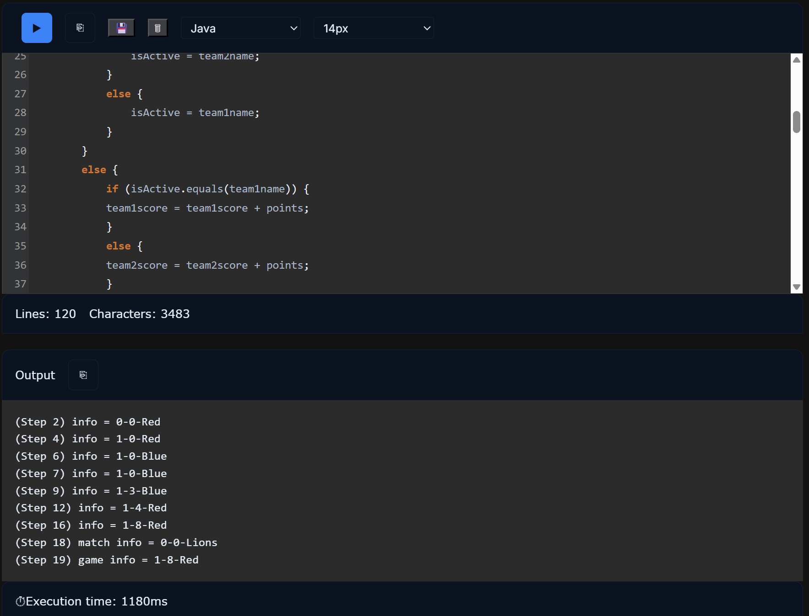

# My Solution on Code Runner



```java
class Scoreboard {
    // Define your properties HERE
    public String team1name;
    public String team2name;
    private int team1score;
    private int team2score;
    private String isActive;

    public Scoreboard(String team1names, String team2names) {
        // This is your CONSTRUCTOR
        // Initialize your properties HERE (team names and active team)
        team1name = team1names;
        team2name = team2names;
        team1score = 0;
        team2score = 0;
        isActive = team1names;
    }

    public void recordPlay(int points) {
        // Create the recordPlay Method HERE
        if (points == 0) {
            if (isActive.equals(team1name)) {
            	isActive = team2name;
            }
            else {
            	isActive = team1name; 
            }
        }
        else {
        	if (isActive.equals(team1name)) {
            team1score = team1score + points;
            }
            else {
            team2score = team2score + points;
            }
        }
    }

    public String getScore() {
        // Create the getScore Method HERE
		String out = team1score + "-" + team2score + "-" + isActive;
        return out; // Modify this return statement to return the actual score with the given format
    }
}
```

It took me 18 minutes to complete this FRQ (i timed it). An area of struggle, and a mistake that I made, was incrementing team1score and team2score by one instead of the `points` variable given in the input of the recordPlay function. I fixed it through running the code and debugging it for a few seconds, however, it may have resulted in a point deduction the AP Exam, as we do not have access to the Java compiler. Overall, I feel that my performance was quite strong and that I completed this assignment in a reasonable timeframe!

